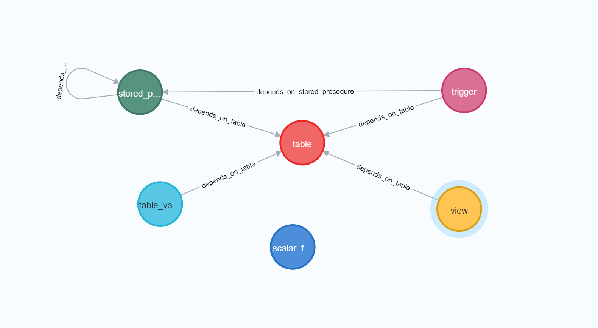
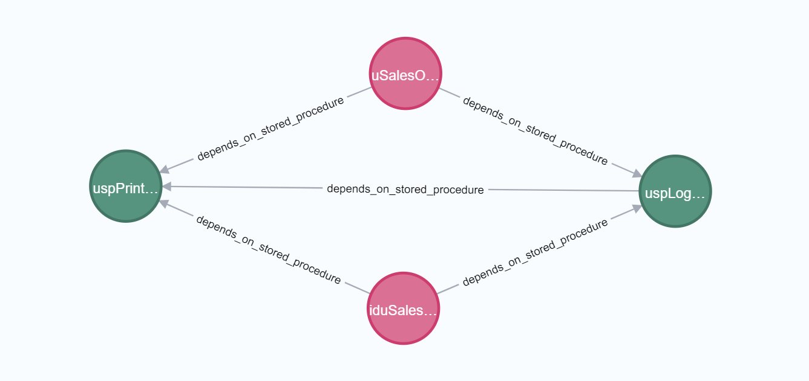
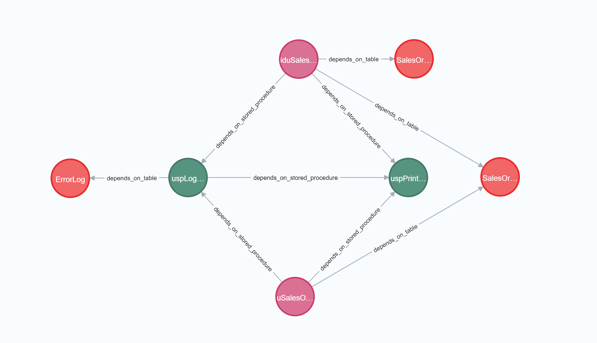
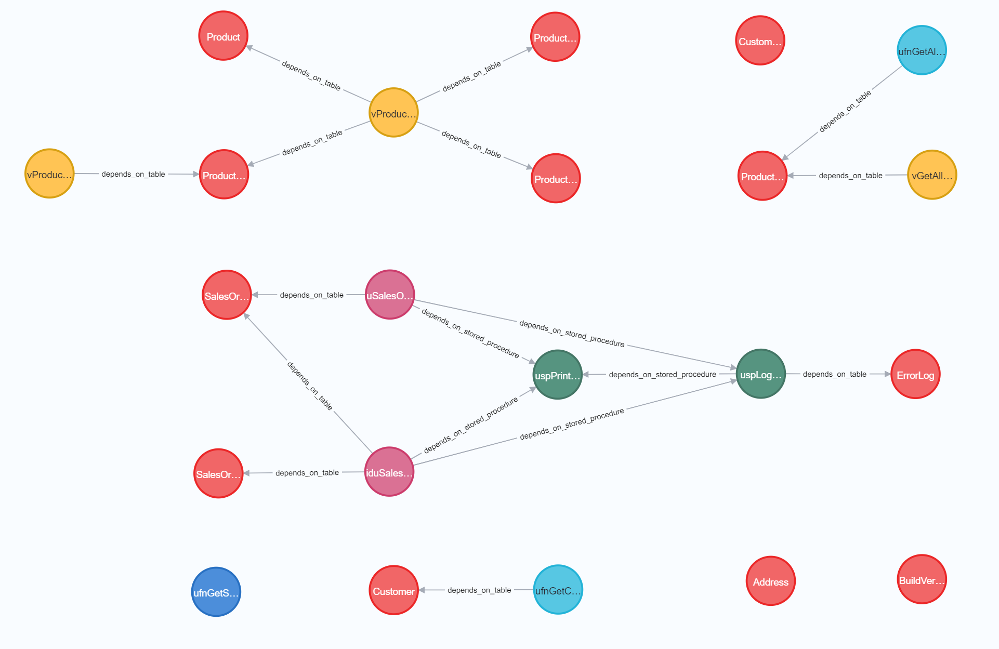

# SQL Server Schema Graph Generator

This is a tool that will create a [Neo4j Graph Database](https://neo4j.com/developer/graph-database/) of [SQL Server](https://www.microsoft.com/en-au/sql-server/sql-server-2019) databases, mapping the objects inter and intra dependencies.

Whilst Neo4j does have the capability to [import data from SQL server](https://neo4j.com/labs/etl-tool/) directly, it does not represent a dataless schema very well. Especially when a database has been developed with very few table Key relationships.

---
# Setup

1. [Install](https://neo4j.com/docs/operations-manual/current/installation/) Neo4j Desktop
2. [Install](https://www.python.org/downloads/) Python
3. Run python script
    ```python
    python -m main.py
    ```

---
# Examples
### The below examples are produced using Microsoft's `AdventureWorksLT2019` database provided under the [cc-by-sa 4.0](https://creativecommons.org/licenses/by-sa/4.0/) license.

## Example 1 - Schema Dependencies Graph

```cypher
call db.schema.visualization()
```



## Example 2 - Object (uspPrintError) Dependencies - Depth 1

```cypher
MATCH (t {name: "uspPrintError"})-[r]-(a) RETURN *
```



## Example 3 - Object (uspPrintError) Dependencies - Depth 3

```cypher
MATCH (t {name: "uspPrintError"})-[r*1..3]-(a) RETURN *
```


---

## Example 4 - Object Dependencies - All

```cypher
MATCH (n) RETURN n
```


---
